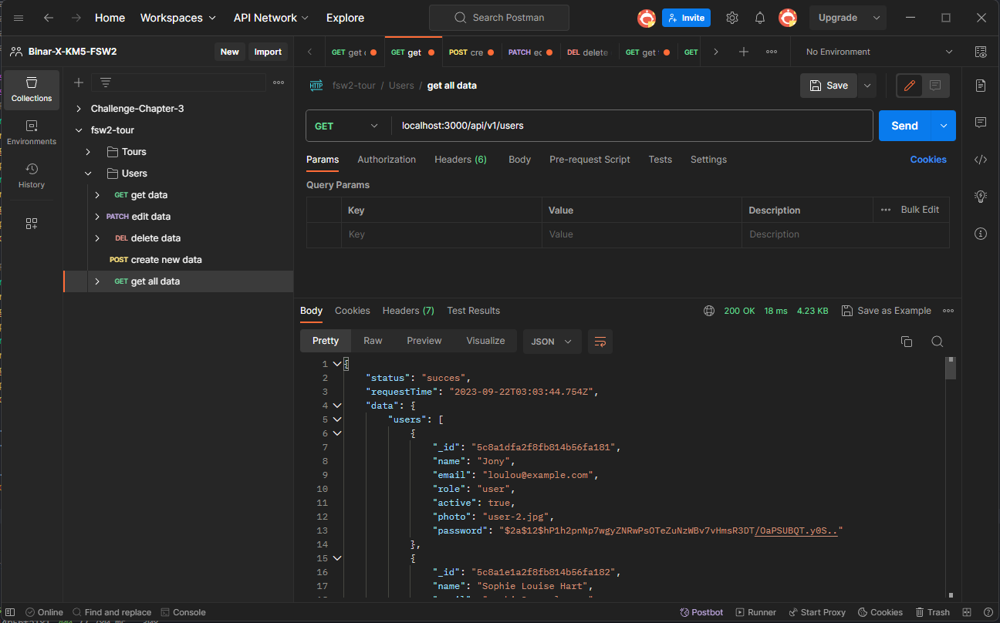
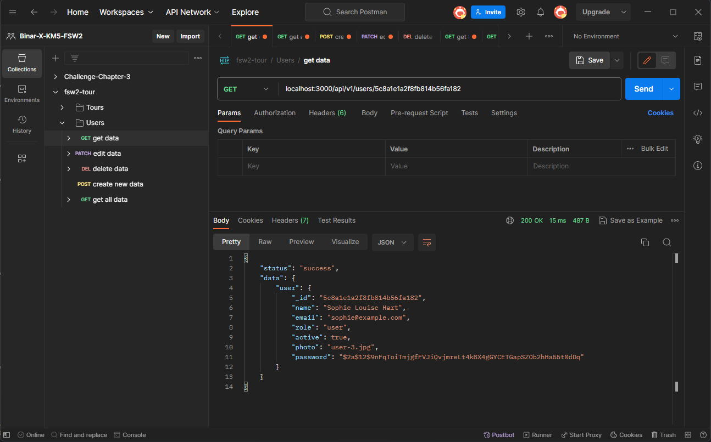
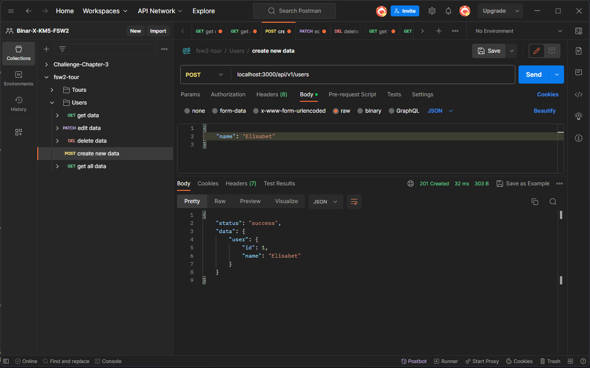
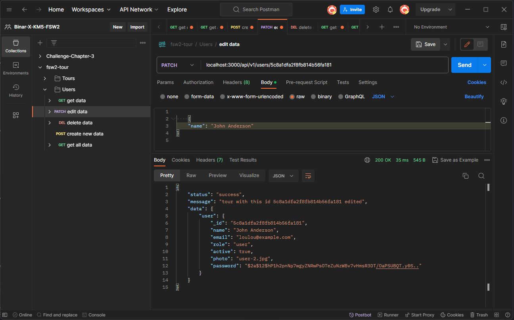
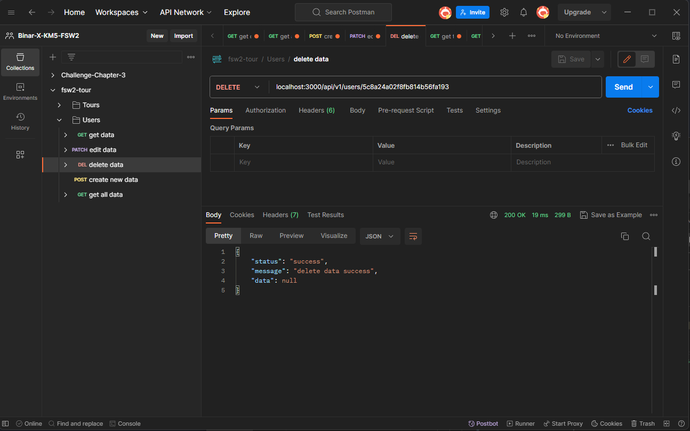

# Daily Task Chapter 3

- Create REST API CRUD Users, menggunakan data users.json lalu refactor routing di 2 resource

##### Hasil Dari Postman

1. Get All Data
   

###

2. Get Data By Id
   

###

3. Create Data
   

###

4. Edit Data
   

###

5. Delete Data
   
